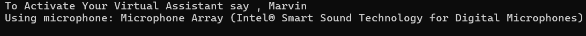
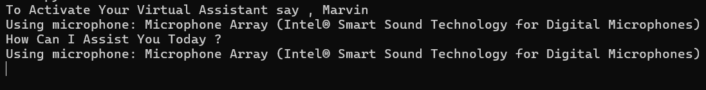
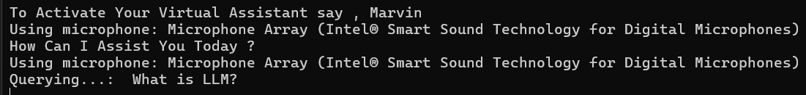
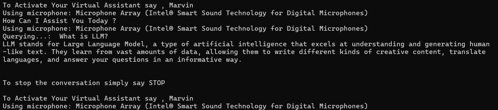
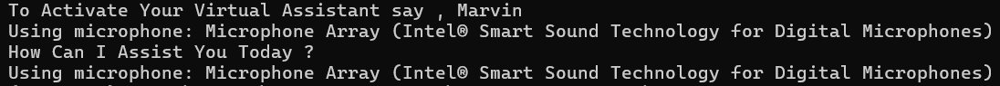

# Voice Virtual Assistant

## How to Use

1. Clone the repository:
   ```bash
   git clone https://github.com/Rohit131313/Voice-Virtual-Assistant.git
   ```

2. Create a `.env` file and add your Gemini API key:
   ```bash
   GEMINI_API_KEY = "your_gemini_api"
   ```

3. Install the required libraries:
   ```bash
   pip install -r requirements.txt
   ```
   And Install ffmpeg too locally 
   
   Since We are using ffmpeg to capture audio from the microphone, please note that this functionality will not work in Google Colab. Google Colab does not support direct audio input from the microphone.To use   ffmpeg for capturing audio, you will need to run the code on your local machine and install ffmpeg locally.

   To Install ffmpeg , For Windows

   1. Download the ffmpeg-git-full.7z executable from [ffmpeg.org.](https://www.gyan.dev/ffmpeg/builds/) 
   2. Extract the downloaded archive.
   3. Add the bin directory of the extracted folder to your system’s PATH environment variable.


5. Run the project:
   ```bash
   python main.py
   ```



### Getting Started

- Speak "Marvin" to start the conversation.



- Then, speak your query. For example, ask **"What is LLM?"** and your virtual assistant will answer.



- The virtual assistant will show the answer in the terminal and also speak it aloud.



### Continuing the Conversation

- To ask another question, simply say **"Marvin"** again, and then ask your next query.

### Ending the Conversation

- To end the conversation, after saying "Marvin" at the start of your query, just say **"stop"** at the end.


